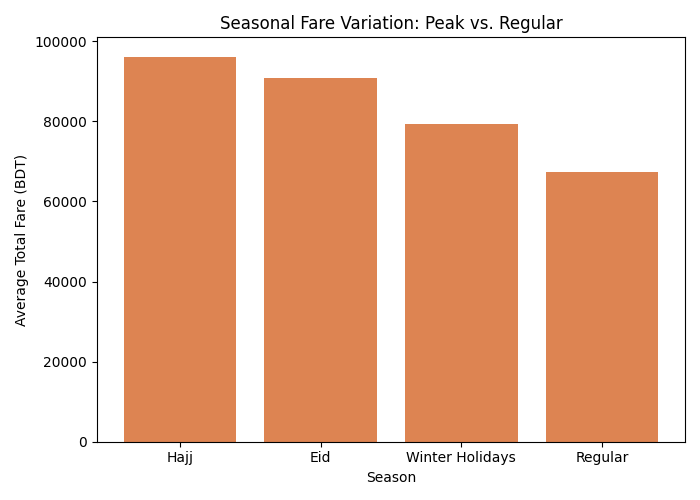
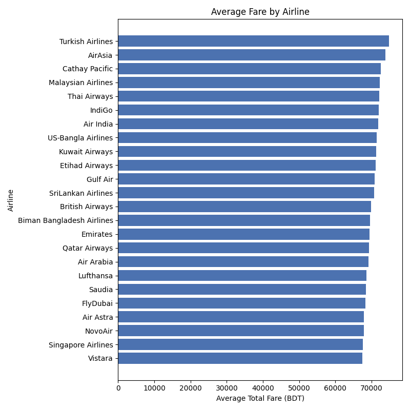
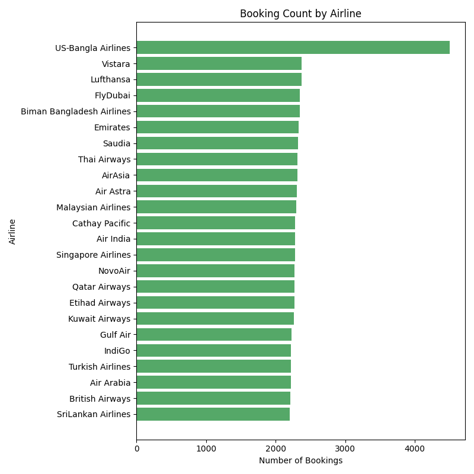
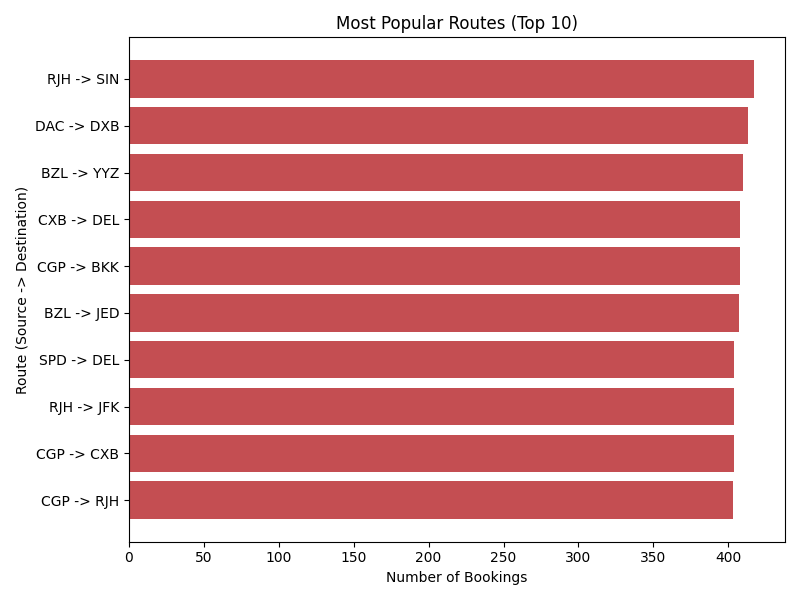

# Flight Price Analysis Pipeline — Report

## Summary (for non-technical readers)

This project automatically processes a dataset of 57,000 flight bookings across Bangladesh's airports and turns it into four business answers, refreshed every time the pipeline runs:

1. **Which airlines are the most expensive, on average?**
2. **How much more do people pay to fly during Eid, Hajj, and Winter Holidays compared to a regular day?**
3. **Which airlines get booked the most?**
4. **Which flight routes are the most popular?**

The pipeline reads the raw booking data, checks it for problems (missing information, negative prices, invalid airport codes), sets aside anything unusable, fixes small pricing inconsistencies, and produces the four answers above as clean tables and charts — with no manual spreadsheet work required.

### Headline numbers (from the current dataset)

- **57,000 bookings** processed; **0 rows** needed to be discarded — the data was clean.
- **2,522 bookings (4.4%)** had a total price that didn't add up correctly (base fare + taxes ≠ listed total); the pipeline recalculated these automatically.
- **Peak seasons cost more, as expected**: Hajj travel averages **96,190 BDT**, Eid averages **90,791 BDT**, and Winter Holidays average **79,256 BDT** — all noticeably above the **67,337 BDT** average for a regular-season booking.
- **24 airlines** are tracked, each with roughly 2,200–2,370 bookings — except **US-Bangla Airlines**, which stands out with **4,496 bookings**, roughly double any other airline.
- The single busiest route is **Rajshahi (RJH) → Singapore (SIN)**, with 417 bookings.






---

## Pipeline Architecture

```
Flight_Price_Dataset_of_Bangladesh.csv (57,000 rows)
        │
        ▼
   MySQL staging (flights_raw / flights_rejected)
        │
        ▼
   validate & quarantine bad rows
        │
        ▼
   recompute inconsistent Total Fare values
        │
        ├──► avg fare by airline ─┐
        ├──► seasonal variation ──┤
        ├──► bookings by airline ─┤
        └──► top 10 routes ───────┘
                                  ▼
                     PostgreSQL analytics DB
                (flights_clean + 4 KPI tables)
```

Orchestrated by a single Apache Airflow DAG (`flight_price_pipeline`), running on Docker Compose: Airflow (webserver + scheduler), a MySQL staging database, and a separate PostgreSQL analytics database.

## DAG Tasks

| Task | Purpose |
|---|---|
| `create_staging_tables` | Idempotently creates the MySQL staging schema (`flights_raw`, `flights_rejected`) |
| `ingest_csv_to_mysql` | Reads the CSV and bulk-loads all rows into `flights_raw`, tagged with the run's `batch_id` |
| `validate_and_quarantine` | Checks each row for missing values, negative fares, and malformed airport codes; moves bad rows to `flights_rejected` with a reason, removing them from `flights_raw` |
| `transform_add_total_fare` | Recomputes `Total Fare` wherever it's missing or doesn't match `Base Fare + Tax & Surcharge` |
| `kpi_avg_fare_by_airline` | Computes mean total fare per airline |
| `kpi_seasonal_variation` | Computes mean fare and booking count per season (Regular / Eid / Hajj / Winter Holidays) |
| `kpi_bookings_by_airline` | Computes total bookings per airline |
| `kpi_top_routes` | Computes the top 10 source → destination pairs by booking count |
| `load_to_postgres` | Loads the cleaned data and all 4 KPI results into PostgreSQL, replacing any prior data for the same `batch_id` (idempotent reruns) |

The four KPI tasks run in parallel, since each is an independent aggregation over the same cleaned dataset.

## KPI Definitions & Computation Logic

| KPI | Definition | Computation |
|---|---|---|
| Average Fare by Airline | Mean total fare, grouped by airline | `groupby(airline)[total_fare].mean()` |
| Seasonal Fare Variation | Mean fare and booking count, grouped by season | `groupby(seasonality)[total_fare].agg(mean, count)` |
| Booking Count by Airline | Total bookings per airline | `groupby(airline).size()` |
| Most Popular Routes | Top 10 source–destination pairs by booking count | `groupby([source, destination]).size()`, sorted descending, top 10 |

`Total Fare` is treated as authoritative from the source data unless it's missing or differs from `Base Fare + Tax & Surcharge` by more than 0.01 BDT, in which case it's recomputed.

## Data Quality Findings

- The source CSV (Kaggle's *Flight Price Dataset of Bangladesh*) was clean: no missing values, no negative fares, no malformed airport codes were found across all 57,000 rows. The quarantine table (`flights_rejected`) is empty for this dataset.
- The validation and quarantine logic was still verified against real data by deliberately injecting two synthetic bad rows (a negative fare and a missing airline) directly into the staging table and confirming both were correctly moved to `flights_rejected` with the right reasons, while the row count in `flights_raw` dropped accordingly. This confirms the defensive logic works even though it doesn't trigger on this particular dataset.
- 2,522 rows (4.4%) had a `Total Fare` that didn't match `Base Fare + Tax & Surcharge`; all were automatically corrected by the transform step.

## Challenges Encountered and How They Were Resolved

- **Airflow provider packages caused slow, unreliable installs.** `apache-airflow-providers-mysql`/`postgres` pull in `mysqlclient`, a C extension that failed to build locally (missing system MySQL headers) and, inside the Airflow image, forced pip to resolve against Airflow's entire dependency graph — this hung for many minutes with no clear end. **Resolution:** dropped both provider packages; connection credentials are now read via Airflow's built-in `BaseHook.get_connection()`, with `mysql-connector-python`/`psycopg2-binary` handling the actual queries directly.
- **The Docker Compose "quick trial" dependency mechanism (`_PIP_ADDITIONAL_REQUIREMENTS`) reinstalled everything on every container boot**, with no version constraints, which was the direct cause of the slow install above. **Resolution:** switched to a proper `Dockerfile` that builds the image once, installing against Airflow's official constraints file for fast, deterministic dependency resolution.
- **Hard-pinning package versions in the image's `requirements.txt` collided with Airflow's constraints file** (e.g. `pandas==2.2.2` vs. the constraints file's `pandas==2.1.4`), causing a `ResolutionImpossible` error. **Resolution:** left image-facing runtime dependencies unpinned (the constraints file governs their versions) and moved pinned dev/lint/test tooling into a separate `requirements-dev.txt` that's never installed into the image.
- **`AIRFLOW_UID` set to the host machine's user ID broke the Airflow CLI** (`getuser()` failed, since that UID doesn't exist inside the container). **Resolution:** kept the image's default `AIRFLOW_UID=50000` — unlike Linux, Docker Desktop on macOS doesn't need host-UID matching for volume permissions.
- **The local Python 3.14 interpreter caused `pip install` to stall indefinitely** (0% CPU for 16+ minutes) on packages without prebuilt wheels for such a new Python version. **Resolution:** created the local development virtual environment with Python 3.12 instead, matching the version used inside the Airflow image.

See `IMPLEMENTATION_PLAN.md` in the repository root for the full build log and milestone-by-milestone history.
